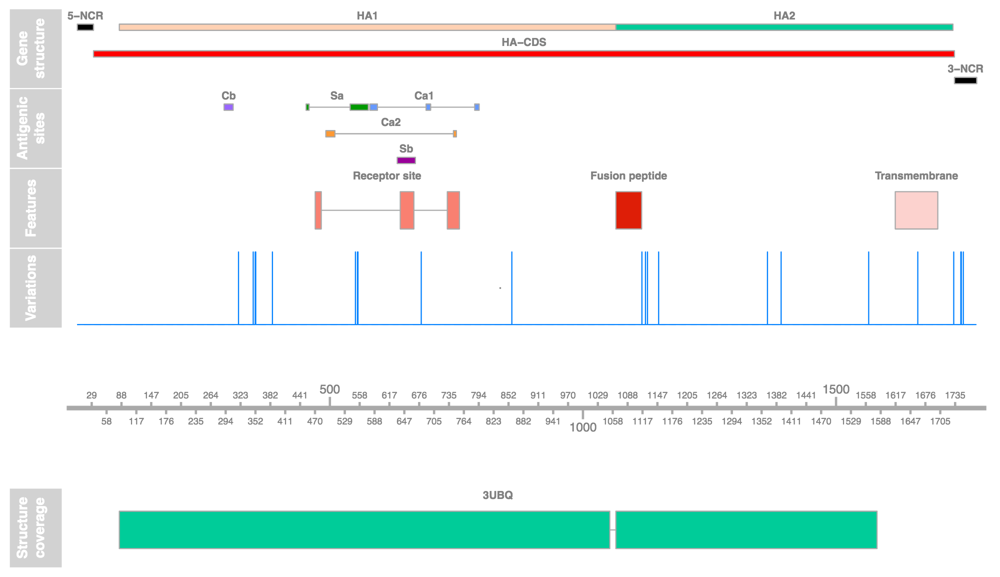
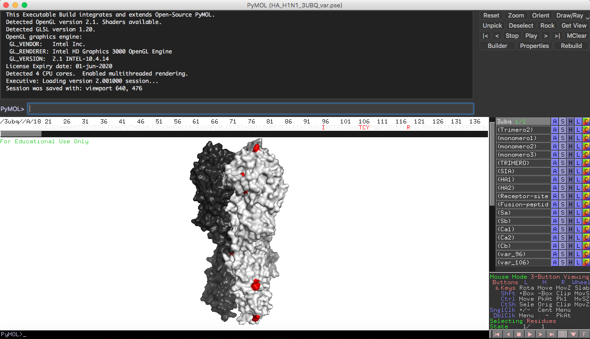

# FluVar #

Flu Variants (FluVar) is tool that highlights positions (nucleotides or amino acid) within the influenza A genome and provides additional information regarding functional annotation associated to the region where the desired position is located (NLS, antigenic regions, protein-protein interacting sites, etc). The program uses as input, a tab-delimited text file containing the positions of interests. The output of the program comprises three file types. First, a single text tab-delimited file (`*_var_annotated.txt`) which contain the position inquired together with the annotation available in each case. Second, a set of PDF files (`*_annotation.pdf`) containing a graphical representation of the position within each segment or protein and its annotation. Third, a set of pymol sessions (`*.pse`) containing, highlighted, the inquired position within a crystallographic structure of the respective influenza protein.

The information collected for each site comes from scientific journals. 

## Software requirements ##

In order to use FluVar the following software and modules should be installed. Its recommended to use `conda` package manager because it is easier to install the modules.

* Python 2.7 version. Additionally, the following python modules should be installed:
   * [PyVCF](https://anaconda.org/bioconda/pyvcf).
   * [Biopython](https://anaconda.org/conda-forge/biopython).
   * [PyMOL](https://anaconda.org/schrodinger/pymol).
 * [R]( https://www.r-project.org/) 3.4.4 version or superior.
   * [Pviz](https://bioconductor.org/packages/release/bioc/html/Pviz.html).
 * [PyMOL](https://anaconda.org/schrodinger/pymol) 2.3.4 version or superior.

## Input file ##

FluVar takes as input a tab-delimited text file as shown below:

    5	350
    8	36

Each row has the position of interest where the first field is the identifier of the segment (`1`, `2`, `3`, `4`, `5`, `6`, `7` or `8`) or protein (`PB2`, `PB1`, `PA`, `HA`, `NP`, `NA`, `M1`, `M2`, `NS1` or `NEP`). The second field is the actual position delivered as a single numeric value (`350`). In the case that the position is relative to the nucleotide sequence (determined by the identifier), an alternative option is allowed were the numeric value is followed by the nucleotides `A`, `C`, `T` or `G` to be used as variations in the respective codon (`350T` or `350AG`).  

## Output files ##
### Tab-delimited text file `*_var_annotated.txt ` ###

A tab-delimited file is generated with the suffix “_var_annotated.txt”. This file contains 8 fields summarized below:

| Field | Description | Example|
| - | - | - |
| 1 | Identifier of the influenza segment or protein where the position is located. Same as the input. |`4`, `PB2`  |
| 2 | Position within the influenza segment or protein to highlighted and complemented with the available annotation.  Same as the input. |`350`, `440A`, `230GC`|
| 3 | Position relative to the built-in reference of the program based on which the annotation coordinates are based on. | `350`, `440A`, `230GC` |
| 4 | For a coding region, here is depicted thee protein name and the amino acid number that match to the given position. This field is empty if the given position is a non-coding region. | `NP:431` |
| 5 | The information regarding to the codon. Here is depicted the actual codon, three positions in the reference where each nucleotide is in the reference and finally, the single-letter code for the amino acid encoded by the codon. This field is empty if the given position is a non-coding region. | `GTA:1558:1559:1560:V `|
| 6 | The information regarding to the amino acid change observed in those case were the position inquired has an specific nucleotide (i.e. `298A`). | `HA:298A:T89K` |
| 7 | The viral strain associated to the inquired position. Only human H1N1 and H3N2 strains are allowed. | `H1N1`, `H3N2` |
| 8 | The annotation separated by “;” of the given site. | `HA-CDS; HA1; Cb`  |

### Figures in PDF files `*_annotation.pdf ` ###

All positions per segment or protein are group in a single figure. Below is shown an example for the hemagglutinin protein where the queried position are highlighted in the track `Variations` by the blue peaks ([PDF](https://github.com/lialmonacid/FluVar/blob/master/examples/example_output/HA_annotation.pdf)<-can be found here).

In the `Structure coverage` track is represented the portion cover by the available crystallographic structure for the given protein. The PDB code is indicated above each box in this track. The PDB structures used by the _FluVar_ are shown in the table below.

| Protein | Segment | PDB codes|
| - | - | - |
| PB2 | 1 | `5FMQ`, `3CW4` and `2JDQ` |
| PB1 | 2 | `2ZTT` |
| PA | 3 | `4AWH` and `2ZNL` |
| HA | 4 | `3UBQ` (H1N1), `3HMG` (H3N2), `1HTM` (H3N2, low pH) |
| NP | 5 | `3ZDP` |
| NA | 6 | `4B7R` (H1N1) |
| M1 | 7 | `4PUS` |
| M2 | 7 | `2RLF` |
| NS1 | 8 | `4OPA`, `2ZKO`, `2RHK` and `3L4Q` |
| NEP | 8 | `1PD3` |

### Pymol sessions files `*.pse` ###

All positions per protein are group in a single pymol session together with its corresponding annotation. Below is shown how it looks the visualization in PyMOL of the expected an pymol session (pymol file `*.pse` can be found [here](https://github.com/lialmonacid/FluVar/blob/master/examples/example_output/HA_H1N1_3UBQ_var.pse).

Inquired positions are highlighted in red. In the side bar, within PyMOL, each feature has been previously selected and named accordingly. User variations are named as `var_` followed by the amino acid number corresponding to each queried position.
